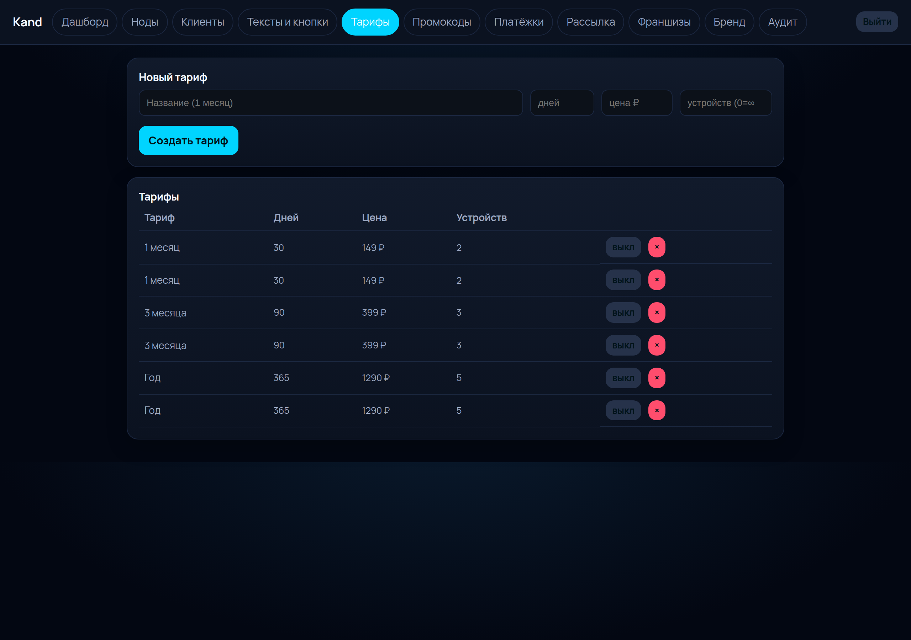

# Kand

Открытая (AGPLv3) панель управления VPN на xray-core (VLESS-Reality / gRPC / Hysteria2 / XHTTP)
с умной маршрутизацией и нативной интеграцией с Telegram. Ноды подключаются одной командой,
без SSH (mTLS + JWT).

> 💬 **Поможем с установкой и переносом клиентов** — пиши в Telegram **[@marius_support](https://t.me/marius_support)**.

## Скриншоты
| Дашборд (клиенты, ноды, доход, график) | Ноды (добавление одной командой) |
|---|---|
|  |  |

| Клиенты | Франшизы (доля и выплаты) |
|---|---|
|  |  |

| Тарифы | Платёжки | Клиент — веб-кабинет |
|---|---|---|
|  |  |  |

<sub>Данные на скриншотах — демонстрационные. Скриншоты обновляются скриптом `tools/screenshots.mjs`.</sub>

## Чем отличается от Remnawave / Marzban / 3x-ui
- 🇷🇺 **Умная маршрутизация (по умолчанию)**: РФ-сервисы (банки, госуслуги, маркетплейсы) — напрямую, остальное — через VPN. Можно **добавить свои сайты** (напрямую/блок/через VPN) в админке.
- ▶️ **YouTube без рекламы** — через ноду с ролью РФ-выхода.
- 🛡 **Лимит трафика на «обход»** — учёт ГБ, докупка/списание, авто-стоп при исчерпании (метринг реализован в панели).
  > ⚠️ Продвинутый **CDN-фронтинг** (клиент → CDN → origin, чтобы прятать факт VPN) в панель НЕ входит — это ваша инфраструктура (свой CDN). Kand даёт VPN + умную маршрутизацию + метринг. См. `docs/routing.md`.
- 🤖 **Клиентский Telegram-бот** — приветствие/кнопки/подписка/оплата/триал, все тексты правятся в вебе.
- 💳 **7 платёжек РУ-рынка** из коробки: ЮKassa, Platega, RollyPay, Wata, Lava, CryptoBot, Cryptomus.
- 📊 **Дашборд и аналитика** — активные клиенты, ноды онлайн, доход (сутки/неделя/месяц), график за 14 дней, последние платежи.
- 🔁 **Автопродление с баланса** — клиент включает сам; при истечении списываем с баланса и продлеваем (без хранения карт). См. `docs/autopay.md`.
- 🌐 **Единая ссылка подписки** — один домен, все ноды внутри; **failover** (мёртвые ноды не отдаются) + **балансировка** по клиенту + **авто-хил** вернувшихся нод. См. `docs/infra.md`.
- 🔑 **Ручная выдача ключа** — создать доступ без Telegram (кому-то на руки) прямо из админки, со ссылками (подписка/кабинет/ТВ).
- 🏷 **Франшизы (опционально)** — свой бренд/бот/домен, изоляция клиентов, **свой бот на франшизу** (мультибот), учёт **доли и выплат**; без них панель одиночная.
- 📺 **ТВ и приложения** — короткий код для Android TV, дип-линки импорта в Happ / v2rayNG / Streisand / Hiddify / NekoBox.
- 🔁 **Миграция** с 3x-ui / Marzban / Remnawave (готовые пресеты) + импорт любой базы по маппингу.
- 🔒 Безопасность заложена: mTLS нод, аудит действий, rate-limit, проверка подписей платёжек.

## Стек
NestJS + PostgreSQL (Prisma) + Redis. Ноды — xray-core + Go-агент (mTLS+JWT). Веб-админка — статика.

## Быстрый старт (dev)
```bash
cp .env.example .env          # заполни ADMIN_PASSWORD, JWT_SECRET, PANEL_URL
npm install
docker compose -f infra/docker-compose.dev.yml up -d   # postgres + redis
npm run prisma:push                                    # накатить схему
npm --prefix apps/api run build && node apps/api/dist/main.js
# админка: http://localhost:3000  (вход по ADMIN_PASSWORD)
```

## Прод (docker-compose)
```bash
cp .env.example .env          # выставь секреты
docker compose -f infra/docker-compose.prod.yml up -d --build
```

## Добавление ноды (одной командой)
В админке «Ноды → добавить» → скопируй команду вида `curl -fsSL https://<панель>/install-node.sh | ... bash`
и выполни на сервере ноды. Он поставит xray + агент, сам подключится к панели. Защита нод от DDoS:
`HARDEN_FIREWALL=1` (см. `docs/routing.md`).

## Миграция с других панелей
Экстрактор `tools/extract.mjs` (3x-ui / Marzban / Remnawave) → dry-run → импорт. Полностью: `docs/migration.md`.

## Документация
- `docs/install.md` — установка «с нуля» для новичка (пошагово).
- `docs/routing.md` — умная маршрутизация, YouTube, обход, защита нод.
- `docs/migration.md` — перенос клиентов/платежей/трафика/нод + сброс счётчика.
- `docs/limits.md` — лимит устройств: HWID (Happ/v2rayTun) + IP (нода) с инструкциями.
- `docs/autopay.md` — автопродление с баланса (recurring) и как подключить карточный рекуррент.
- `docs/infra.md` — отказоустойчивость флота: failover, балансировка, авто-хил.
- `docs/security-audit.md` — аудит безопасности + правило по nginx (CVE-2025-1974 и др.).

## Структура проекта (что где)
```
apps/api/            — бэкенд (NestJS) и веб-админка
  src/auth           — вход по паролю → JWT, анти-брутфорс
  src/crypto         — своя CA, mTLS-сертификаты нод, ключи Reality
  src/nodes          — CRUD нод + генерация команды установки «одной командой»
  src/nodes-agent    — mTLS-клиент к агентам нод (apply/state/health/stats)
  src/reconcile      — раскатка ключей по нодам (идемпотентно)
  src/users          — клиенты (изоляция по тенанту, триал, ручная выдача ключа)
  src/devices        — устройства = vless-uuid + токен подписки + код для ТВ
  src/subscription   — выдача подписки: ссылки + умный xray-конфиг (RU-direct, YouTube), failover/балансировка
  src/bypass         — обход белых списков: лимит ГБ, докупка/списание, сброс счётчика
  src/stats          — сбор трафика с нод (раз в 5 мин) → лимиты
  src/payments       — реестр платёжек (ЮKassa/Platega/RollyPay/Wata/Lava/CryptoBot/Cryptomus) + оплата с баланса
  src/dashboard      — сводка/аналитика: клиенты, ноды, доход, график, платежи
  src/monitoring     — здоровье нод, авто-хил, напоминания, автопродление с баланса
  src/settings       — тексты/кнопки бота (не пустые, из БД или дефолт) + бренд
  src/broadcast      — рассылка через бота (текст и копия с премиум-эмодзи)
  src/import         — импорт базы (users/payments/usage/nodes/promocodes) + маппинг
  src/tenants        — франшизы (опционально): бренд/бот/домен, изоляция, доля и выплаты
  src/bot            — платформенный клиентский бот (меню/подписка/оплата/триал/автопродление)
  src/multibot       — боты франшиз (по одному на франшизу, изоляция по тенанту)
  src/cabinet        — клиентский веб-кабинет (/cabinet/<токен>)
  src/audit          — аудит действий в админке (секреты скрыты)
  src/install        — раздача install-node.sh и бинаря агента
  public/            — веб-админка (index.html/app.js) и кабинет (cabinet.html)
agent/               — Go-агент ноды (xray reconcile, mTLS+JWT, /stats) + Dockerfile
packages/db/         — схема БД (Prisma/PostgreSQL)
tools/extract.mjs    — экстрактор для миграции (SQLite/MySQL/PostgreSQL)
docs/                — install / routing / migration / limits / autopay / infra / security-audit
infra/               — docker-compose (dev и prod)
```

## Безопасность
Исходный код открыт. Не коммить `.env`. Смени `ADMIN_PASSWORD` и `JWT_SECRET`. Для нод под нагрузкой —
хостинг с анти-DDoS (локальные лимиты не спасают от объёмного флуда). Нашёл уязвимость — см. `SECURITY.md`.

## Лицензия
[AGPL-3.0-only](LICENSE). Если запускаешь Kand как публичный сервис — обязан открыть свои изменения.
