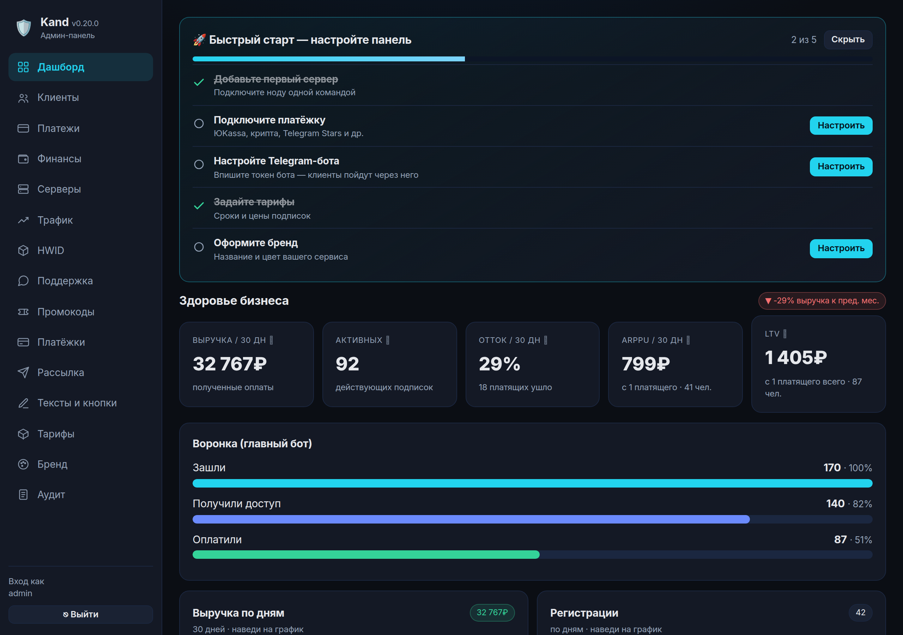
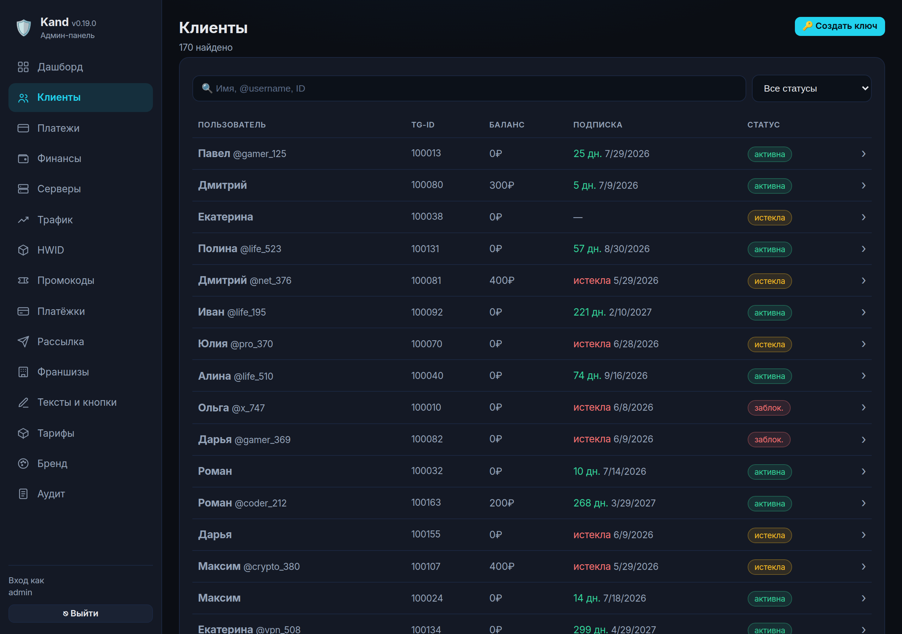
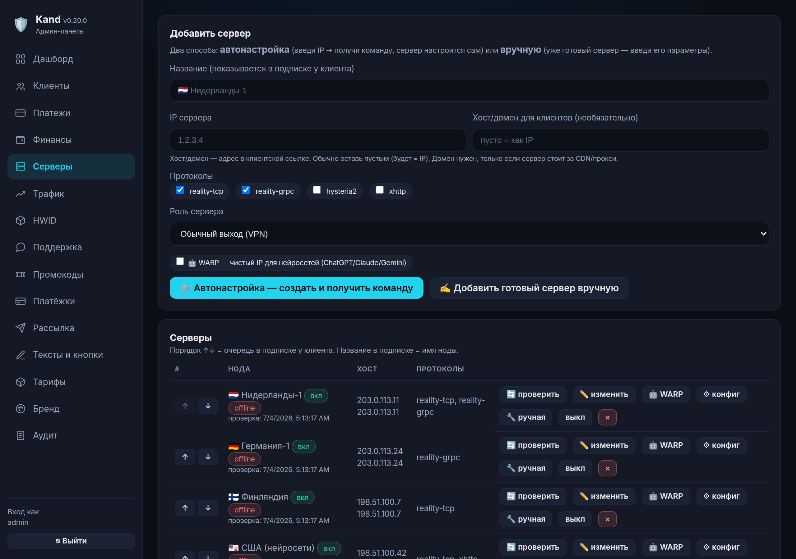
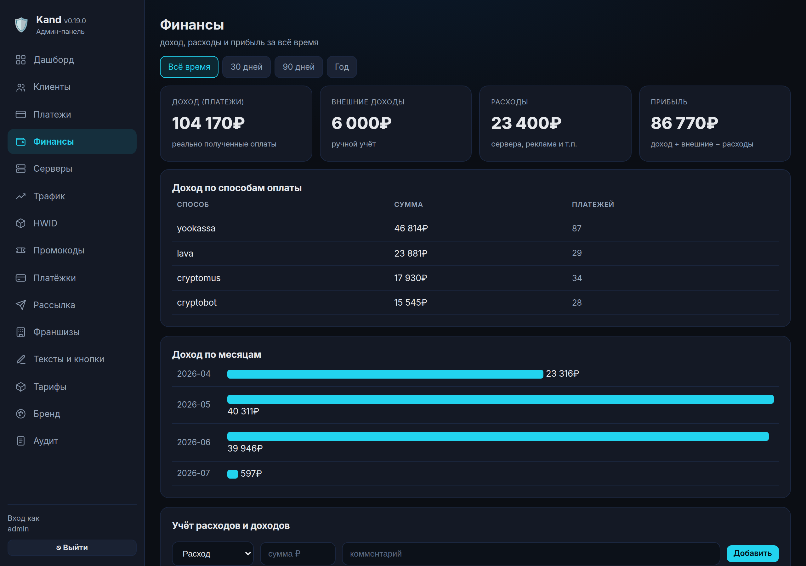
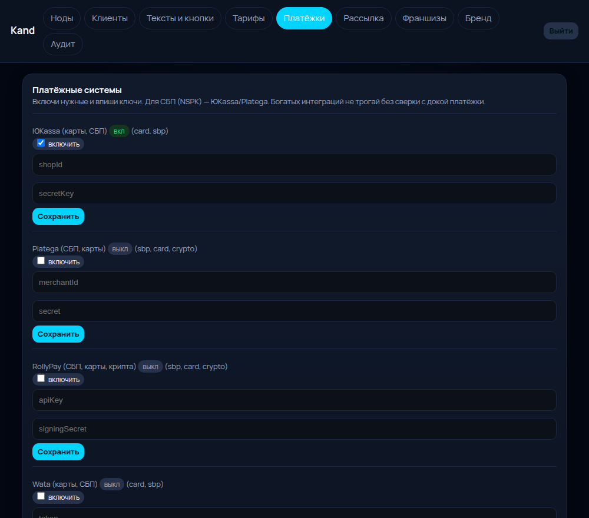
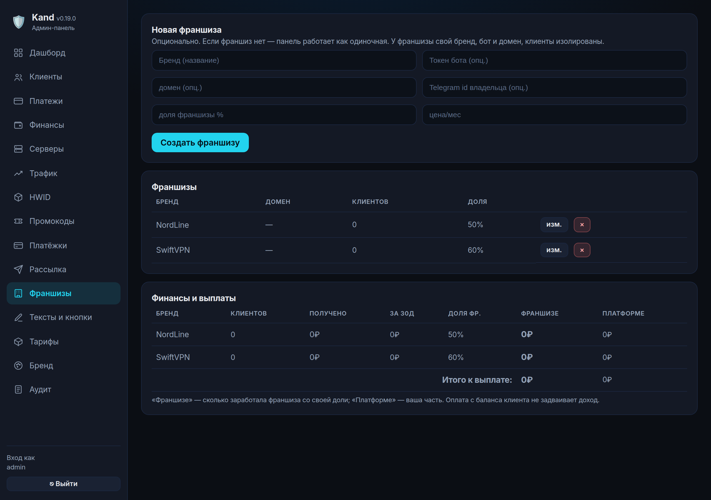
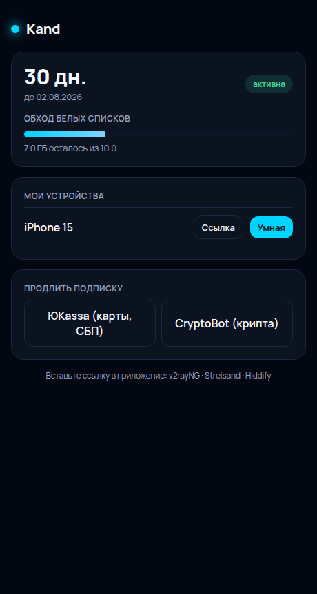

# Kand

Открытая (AGPLv3) панель управления VPN на xray-core (VLESS-Reality / gRPC / Hysteria2 / XHTTP)
с умной маршрутизацией и нативной интеграцией с Telegram. Ноды подключаются одной командой,
без SSH (mTLS + JWT).

> ⚠️ **Панель в бета-версии (0.x).** Активно развивается — возможны баги.
> Нашли баг или нужна помощь с установкой/переносом — пишите в Telegram **[@marius_support](https://t.me/marius_support)**.
> Обновления и список изменений — в [CHANGELOG.md](CHANGELOG.md).

> 👀 **Живое демо (потрогать руками):** [demo.kandpanel.com](https://demo.kandpanel.com) · пароль `demo` — синтетические данные, сбрасывается ежедневно.
> 🧩 **Установка кликами:** [конфигуратор](https://kandpanel.com/setup.html) — выберите домен, протоколы и возможности → получите готовую команду.

## Содержание
- [Скриншоты](#скриншоты)
- [Все возможности](#все-возможности)
- [Чем отличается от Remnawave / Marzban / 3x-ui](#чем-отличается-от-remnawave--marzban--3x-ui)
- [Быстрый старт (dev)](#быстрый-старт-dev)
- [Прод (docker-compose)](#прод-docker-compose)
- [Добавление ноды одной командой](#добавление-ноды-одной-командой)
- [Демо-стенд со скриншотами](#демо-стенд)
- [Документация](#документация)
- [Структура проекта](#структура-проекта-что-где)
- [Безопасность](#безопасность) · [Лицензия](#лицензия)

## Скриншоты
Данные на скриншотах — **демонстрационные** (генерируются `tools/seed-demo.mjs`, реальных клиентов нет).

| Дашборд — здоровье бизнеса, воронка, графики, прогноз | Клиенты — поиск, статусы, карточка |
|---|---|
|  |  |

| Серверы — онлайн/нагрузка/трафик, тумблер в подписке | Финансы — доход/расход/прибыль по периодам |
|---|---|
|  |  |

| Платежи | Франшизы (доля и выплаты) | Клиент — веб-кабинет |
|---|---|---|
|  |  |  |

## Все возможности

**Дашборд и аналитика**
- Здоровье бизнеса: выручка/30 дн с ростом к прошлому месяцу, активные, **отток** (только среди платящих), **ARPPU**, **LTV** — с расшифровкой каждой метрики.
- Воронка: зашли → получили доступ → оплатили.
- Графики выручки и регистраций по дням (с осями и тултипами), **прогноз дохода** на следующий месяц с коридором.
- Карточка живого бэкенда (онлайн-клиенты/устройства, трафик) при подключённом мосте.

**Клиенты**
- Список с поиском, фильтром по статусу (активные/истёкшие/заблокированные) и пагинацией — держит десятки тысяч.
- Карточка: выдать/снять дни и ГБ обхода, блок/разблок, сброс счётчика обхода, тумблер обхода, force-enable, выдать/удалить ключ, правка баланса, устройства и ссылки подписки/кабинета/ТВ.
- **HWID** и **Трафик** — вкладки для контроля шеринга и топа по объёму.
- Ручная выдача ключа (доступ без Telegram — «на руки»).

**Серверы (ноды)**
- Добавление **одной командой** (curl) — нода сама ставит xray + агент и подключается (mTLS+JWT, без SSH).
- Ручное добавление уже готового сервера (свои pbk/sid/sni/порты).
- Протоколы: reality-tcp / reality-grpc / hysteria2 / xhttp. Роли: обычный выход, РФ-выход для YouTube, origin для обхода, WARP (чистый IP для нейросетей).
- Порядок в подписке (↑↓), переименование, тумблер показа в подписке, статус онлайн/нагрузка/трафик, проверка здоровья.

**Подписка и маршрутизация**
- Единая ссылка подписки (все ноды внутри), **failover** мёртвых нод + балансировка + авто-хил.
- Умная маршрутизация: РФ-сервисы напрямую, остальное через VPN; YouTube без рекламы через РФ-выход.
- Дип-линки импорта: Happ / v2rayNG / Streisand / Hiddify / NekoBox / Clash; короткий код для Android TV.
- Лимит трафика на «обход»: учёт ГБ, докупка/списание, авто-стоп при исчерпании.

**Оплаты и финансы**
- 7 платёжек РУ-рынка из коробки: ЮKassa, Platega, RollyPay, Wata, Lava, CryptoBot, Cryptomus.
- Экран платежей: поиск, фильтр по статусу, ручная смена статуса.
- Финансы: доход по способам и месяцам, ручной учёт расходов/доходов, прибыль, **выбор периода** (всё/30/90/365 дн).
- Промокоды (дни / ГБ обхода / баланс) — создание и правка.
- **Автопродление с баланса** (recurring без хранения карт).

**Telegram-бот и кабинет**
- Клиентский бот: приветствие/кнопки/подписка/оплата/триал/автопродление — все тексты и кнопки правятся в вебе.
- Веб-кабинет клиента (`/cabinet/<токен>`): подписка, обход, устройства с дип-линками и QR, оплата, гайд.
- Рассылка через бота (текст + копия с премиум-эмодзи).
- **Поддержка (тикеты):** клиент пишет из бота/кабинета → обращение падает в панель, ответ уходит клиенту в Telegram.
- **Гибкий набор функций:** при установке выбираете, какие возможности включить — выключенное не грузит сервер (конфигуратор + `--disable`/`--enable`).

**Франшизы (опционально)**
- Свой бренд/цвет/бот/домен, изоляция клиентов по тенанту, свой бот на франшизу (мультибот), учёт доли и выплат. Без них — панель одиночная.

**Миграция и безопасность**
- Импорт с 3x-ui / Marzban / Remnawave (готовые пресеты) и любой базы по маппингу.
- mTLS нод, аудит действий в админке, rate-limit, проверка подписей платёжек, вход по паролю → JWT с анти-брутфорсом.

## Чем отличается от Remnawave / Marzban / 3x-ui
- 🇷🇺 **Умная маршрутизация из коробки**: РФ-сервисы напрямую, остальное через VPN; можно добавлять свои сайты.
- ▶️ **YouTube без рекламы** через ноду с ролью РФ-выхода.
- 🛡 **Лимит трафика на «обход»** с докупкой/списанием и авто-стопом (метринг в панели).
  > ⚠️ Продвинутый **CDN-фронтинг** (клиент → CDN → origin) в панель не входит — это ваша инфраструктура. См. `docs/routing.md`.
- 🤖 **Клиентский Telegram-бот** и **веб-кабинет** — из коробки, тексты правятся в вебе.
- 💳 **7 платёжек РУ-рынка**, автопродление с баланса.
- 🏷 **Франшизы** с изоляцией, мультиботом и учётом выплат.
- 🔒 Безопасность заложена: mTLS нод, аудит, rate-limit, проверка подписей платёжек.

## Быстрый старт (dev)
```bash
cp .env.example .env          # заполни ADMIN_PASSWORD, JWT_SECRET, PANEL_URL
npm install
docker compose -f infra/docker-compose.dev.yml up -d   # postgres + redis
npm run prisma:push                                    # накатить схему
npm --prefix apps/api run build && node apps/api/dist/main.js
# админка: http://localhost:3000  (вход по ADMIN_PASSWORD)
```

## Установка одной командой (прод)
На чистом сервере (Ubuntu/Debian) — ставит Docker, тянет код, генерит секреты, поднимает панель:
```bash
# по IP (быстрый старт):
curl -fsSL https://raw.githubusercontent.com/meid1/kand-panel/main/install.sh | bash

# по домену с авто-HTTPS (домен A-записью должен указывать на сервер):
curl -fsSL https://raw.githubusercontent.com/meid1/kand-panel/main/install.sh | bash -s -- --domain vpn.example.com --https
```
В конце скрипт выведет адрес панели, логин и пароль. Повторный запуск = обновление (секреты сохраняются).
Флаги: `--domain --https --port --password --bot-token --dir`. Скрипт: [`install.sh`](install.sh).

### Или вручную (docker-compose)
```bash
cp .env.example .env          # выставь секреты (ADMIN_PASSWORD, JWT_SECRET, PANEL_URL=https://<домен>)
docker compose -f infra/docker-compose.prod.yml up -d --build
# поставь nginx + HTTPS (certbot) на PANEL_URL → 127.0.0.1:3000
```
Полная пошаговая установка «с нуля» для новичка — **[docs/install.md](docs/install.md)**.

## Обновление и кастомизация

**Обновиться:**
```bash
kand update          # сначала бэкап БД, потом новая версия; данные и настройки сохраняются
```
`kand update` делает бэкап базы → тянет новую версию → пересобирает → накатывает миграции
автоматически. Клиенты, платежи, тарифы, бренд — **в базе (том postgres), обновление их не трогает**.
Другие команды: `kand backup`, `kand logs`, `kand restart`, `kand status`, `kand version`.

**Что переживает обновление без вашего участия:**
- Всё, что настраивается **в самой панели** — бренд, тексты и кнопки бота, тарифы, цены, ключи
  платёжек, вкл/выкл фич, маршрутизация. Хранится в БД.
- Секреты и конфиг — в `.env` (не перезаписывается).

**Если вы правили КОД** (исходники, а не настройки в панели):
- `kand update` остановится и предупредит, чтобы не потерять ваши правки.
- Правильный путь: **сделайте форк** репозитория, ставьте панель с `--repo <ваш-форк>` и
  вливайте обновления через git. Либо `kand update --force` (спрячет правки в `git stash`).
- Совет: **меняйте всё через панель, а не в коде** — тогда обновления проходят бесшовно.

## Добавление ноды (одной командой)
В админке «Серверы → добавить» → скопируй команду вида `curl -fsSL https://<панель>/install-node.sh | ... bash`
и выполни на сервере ноды. Он поставит xray + агент, сам подключится к панели. Защита нод от DDoS:
`HARDEN_FIREWALL=1` (см. `docs/routing.md`).

## Демо-стенд
Хотите посмотреть все экраны на демо-данных локально:
```bash
# 1) поднимите панель (dev, см. выше), затем засейте демо-данные:
DATABASE_URL=postgres://... node tools/seed-demo.mjs      # 170 клиентов, платежи, ноды, франшизы — всё выдуманное
# 2) (пере)генерация скриншотов для README:
node tools/screenshots.mjs http://localhost:3000 <ADMIN_PASSWORD> <cabinetToken>
```
`seed-demo.mjs` создаёт только синтетические данные (никаких реальных клиентов).

## Миграция с других панелей
Экстрактор `tools/extract.mjs` (3x-ui / Marzban / Remnawave) → dry-run → импорт. Полностью: `docs/migration.md`.

## Документация
- `docs/install.md` — установка «с нуля» для новичка (пошагово).
- `docs/routing.md` — умная маршрутизация, YouTube, обход, защита нод.
- `docs/migration.md` — перенос клиентов/платежей/трафика/нод + сброс счётчика.
- `docs/limits.md` — лимит устройств: HWID (Happ/v2rayTun) + IP (нода) с инструкциями.
- `docs/autopay.md` — автопродление с баланса (recurring) и карточный рекуррент.
- `docs/infra.md` — отказоустойчивость флота: failover, балансировка, авто-хил.
- `docs/security-audit.md` — аудит безопасности + правило по nginx (CVE-2025-1974 и др.).

## Структура проекта (что где)
```
apps/api/            — бэкенд (NestJS) и веб-админка
  src/auth           — вход по паролю → JWT, анти-брутфорс
  src/crypto         — своя CA, mTLS-сертификаты нод, ключи Reality
  src/nodes          — CRUD нод + генерация команды установки «одной командой»
  src/nodes-agent    — mTLS-клиент к агентам нод (apply/state/health/stats)
  src/reconcile      — раскатка ключей по нодам (идемпотентно)
  src/users          — клиенты (изоляция по тенанту, триал, ручная выдача ключа)
  src/devices        — устройства = vless-uuid + токен подписки + код для ТВ
  src/subscription   — выдача подписки: ссылки + умный xray-конфиг (RU-direct, YouTube), failover/балансировка
  src/bypass         — обход белых списков: лимит ГБ, докупка/списание, сброс счётчика
  src/stats          — сбор трафика с нод (раз в 5 мин) → лимиты
  src/payments       — реестр платёжек (ЮKassa/Platega/RollyPay/Wata/Lava/CryptoBot/Cryptomus) + оплата с баланса
  src/finance        — доход/расход/прибыль, учёт (ledger), период
  src/dashboard      — сводка/аналитика: здоровье бизнеса, воронка, графики, прогноз
  src/sync           — синхронизация из внешней БД бота (для гибридных установок)
  src/bridge         — мост к внешнему бэкенду подписок (опционально)
  src/monitoring     — здоровье нод, авто-хил, напоминания, автопродление с баланса
  src/settings       — тексты/кнопки бота (из БД или дефолт) + бренд
  src/broadcast      — рассылка через бота (текст и копия с премиум-эмодзи)
  src/import         — импорт базы (users/payments/usage/nodes/promocodes) + маппинг
  src/tenants        — франшизы (опционально): бренд/бот/домен, изоляция, доля и выплаты
  src/bot            — платформенный клиентский бот (меню/подписка/оплата/триал/автопродление)
  src/multibot       — боты франшиз (по одному на франшизу, изоляция по тенанту)
  src/cabinet        — клиентский веб-кабинет (/cabinet/<токен>)
  src/audit          — аудит действий в админке (секреты скрыты)
  src/install        — раздача install-node.sh и бинаря агента
  public/            — веб-админка (index.html/app.js) и кабинет (cabinet.html)
agent/               — Go-агент ноды (xray reconcile, mTLS+JWT, /stats) + Dockerfile
packages/db/         — схема БД (Prisma/PostgreSQL)
tools/extract.mjs    — экстрактор для миграции (SQLite/MySQL/PostgreSQL)
tools/seed-demo.mjs  — синтетические демо-данные · tools/screenshots.mjs — скриншоты для README
docs/                — install / routing / migration / limits / autopay / infra / security-audit
infra/               — docker-compose (dev и prod)
```

## Рекомендации перед запуском (для владельца сервиса)
- **Гибкая установка:** в [конфигураторе](https://kandpanel.com/setup.html) включайте только нужные возможности — лишнее не грузит сервер. Всё можно поменять позже в панели.
- **Первая настройка:** после установки панель покажет мастер «Быстрый старт» (сервер → платёжка → бот → тарифы → бренд) — пройдите 5 шагов.
- **Хостинг нод:** берите провайдера с анти-DDoS; для Reality маскируйтесь под реальный SNI. Не держите ноды и панель на одном IP.
- **Оплаты:** подключите минимум 2 способа (карты/СБП + крипта) — конверсия выше. Включите автопродление с баланса.
- **Поддержка:** включите тикеты — обращения из бота падают прямо в панель, ответ уходит клиенту в Telegram. Быстрый ответ = меньше возвратов.
- **Безопасность:** смените `ADMIN_PASSWORD`/`JWT_SECRET` (install.sh генерит случайные), делайте бэкапы БД, следите за лимитом «обхода».
- **Рост:** используйте промокоды и реферальную программу; для нескольких брендов — франшизы (изоляция клиентов).

## Безопасность
Исходный код открыт. Не коммить `.env`. Смени `ADMIN_PASSWORD` и `JWT_SECRET`. Для нод под нагрузкой —
хостинг с анти-DDoS (локальные лимиты не спасают от объёмного флуда). Нашёл уязвимость — см. `SECURITY.md`.

## Лицензия
[AGPL-3.0-only](LICENSE). Если запускаешь Kand как публичный сервис — обязан открыть свои изменения.
